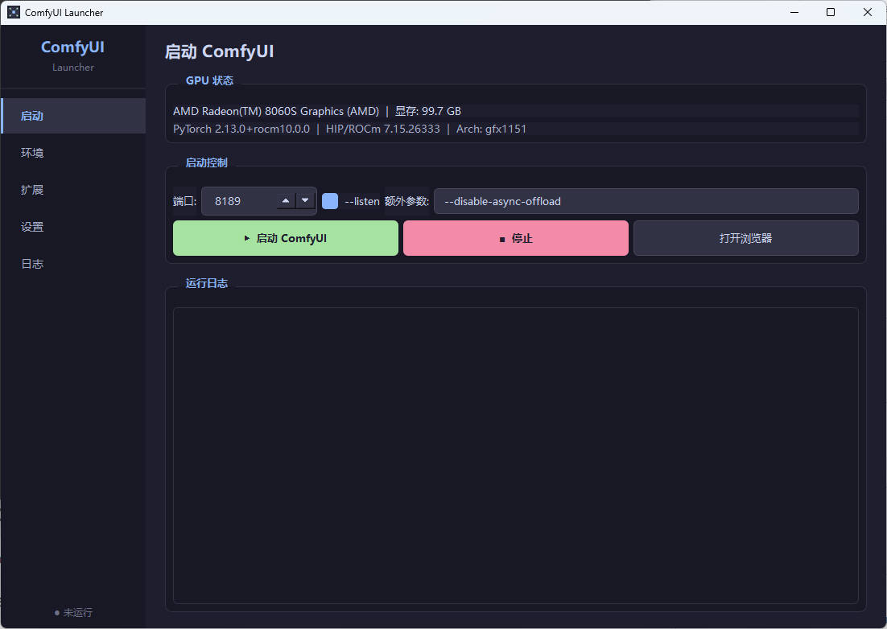
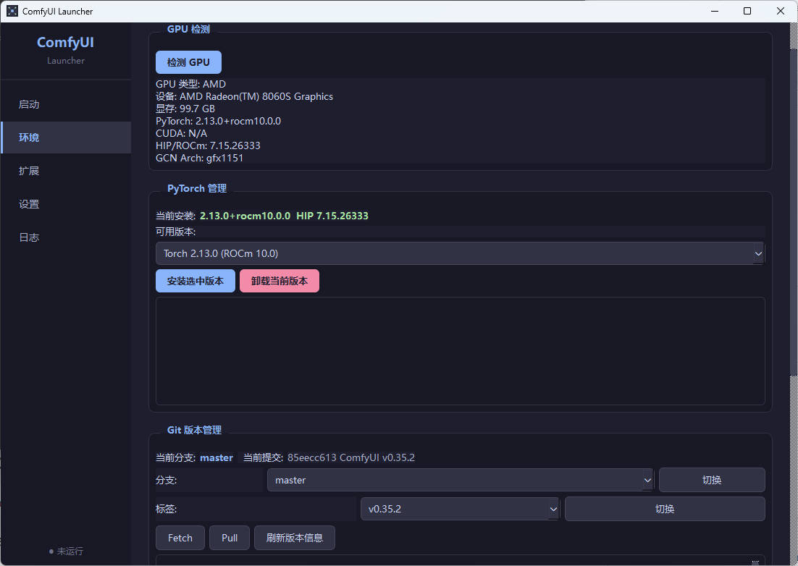
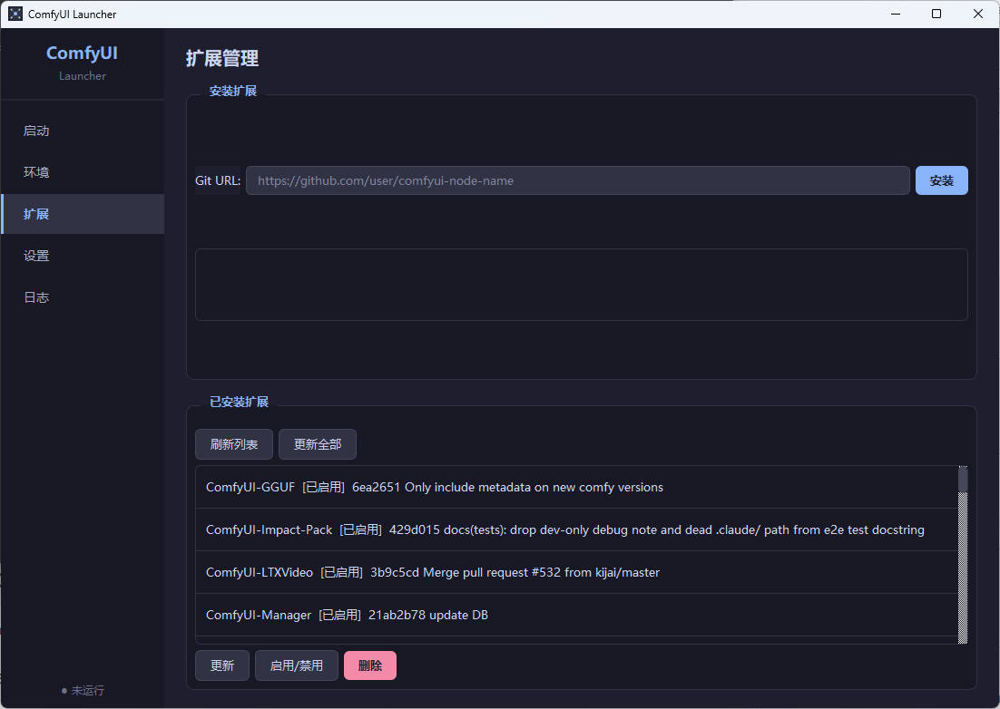
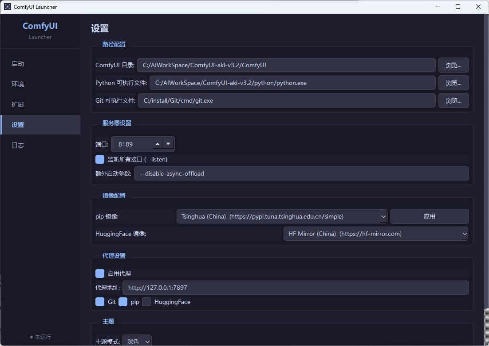

# ComfyUI Launcher

A simple Python + PyQt6 launcher for ComfyUI with AMD ROCm support.

## Screenshots

### 启动页面


### 环境管理


### 扩展管理


### 设置页面


## Features

- GPU auto-detection (NVIDIA CUDA / AMD ROCm / Intel XPU / CPU)
- PyTorch version management (install/switch versions)
- One-click ComfyUI start/stop
- Configurable server settings (port, listen, extra args)
- Custom node extension management (install/update/remove via Git)
- Proxy settings for Git and pip
- HuggingFace mirror support
- UTF-8 encoding support for international characters

## Installation

```bash
cd C:/workspace/comfyui/ComfyUI-Launcher
pip install -r requirements.txt
```

## Usage

双击 `start.bat` 即可启动。

## First Run

1. Go to **设置** tab
2. Set **ComfyUI 目录** (e.g., `C:/workspace/comfyui/ComfyUI`)
3. Set **Python 可执行文件** (e.g., `C:/workspace/comfyui/python/python.exe`)
4. Set **Git 可执行文件** (e.g., `C:/install/Git/bin/git.exe`)
5. Click **保存设置**
6. Go to **启动** tab and click **启动 ComfyUI**

## Proxy Configuration

For users behind a firewall or in regions with limited GitHub access:

1. Go to **设置** tab
2. Enable **启用代理** and enter proxy address (e.g., `http://127.0.0.1:7890`)
3. Check **Git** to apply proxy to git operations
4. Check **pip** to apply proxy to pip operations
5. Click **保存设置**

The proxy is applied via `git config --global` for Git operations.

## Extension Management

Install custom nodes from the **扩展** tab:

1. Enter Git URL (e.g., `https://github.com/user/ComfyUI-CustomNode.git`)
2. Click **安装**
3. The `.git` suffix is automatically removed from folder names

Manage installed extensions:
- **更新**: Pull latest changes for selected extension
- **删除**: Delete extension folder
- **启用/禁用**: Toggle extension without deleting

## AMD ROCm Support

This launcher correctly detects AMD GPUs with ROCm PyTorch and won't force DirectML mode like the original launcher.

## Project Structure

```
ComfyUI-Launcher/
── main.py                 # Entry point
├── start.bat               # Quick start script
├── images/                 # Screenshots
├── launcher/
│   ├── __init__.py
│   ├── window.py           # Main window UI
│   ├── gpu_detector.py     # GPU detection
│   ├── torch_manager.py    # PyTorch version management
│   ├── comfyui_runner.py   # ComfyUI process runner
│   ├── extension_manager.py # Custom node management
│   ├── mirror_manager.py   # Mirror and proxy configuration
│   ├── workers.py          # Background task workers
│   ├── utils.py            # Utility functions
│   ── settings.py         # Configuration management
├── requirements.txt
└── README.md
```
